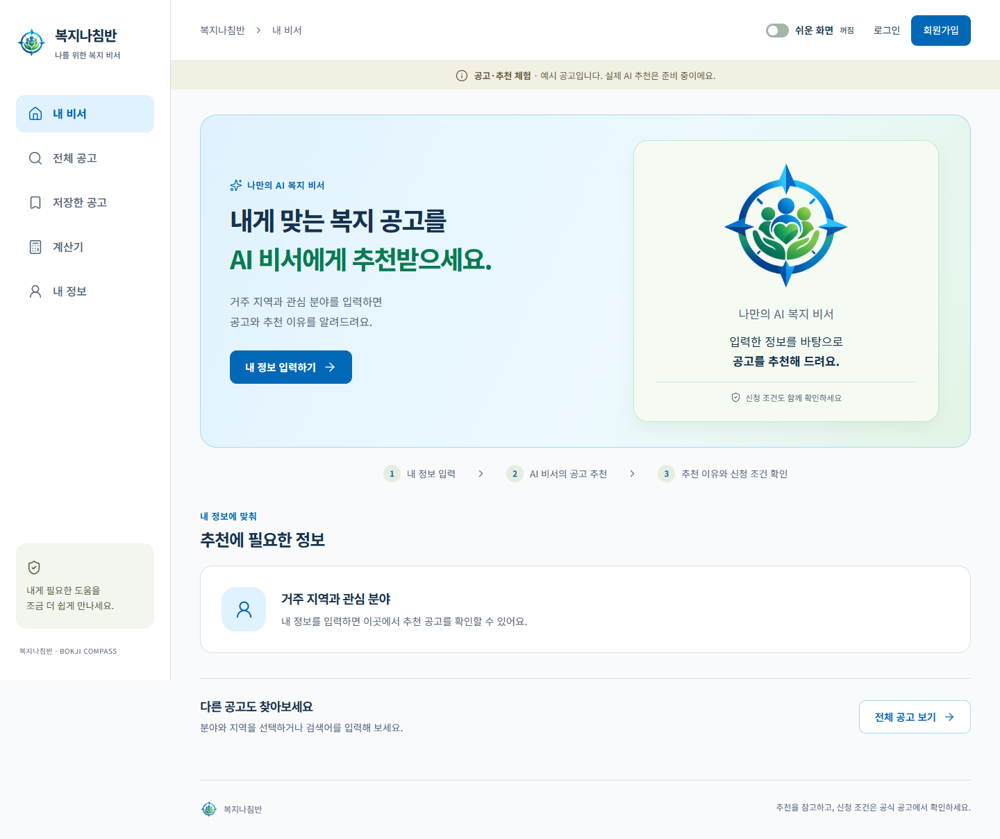
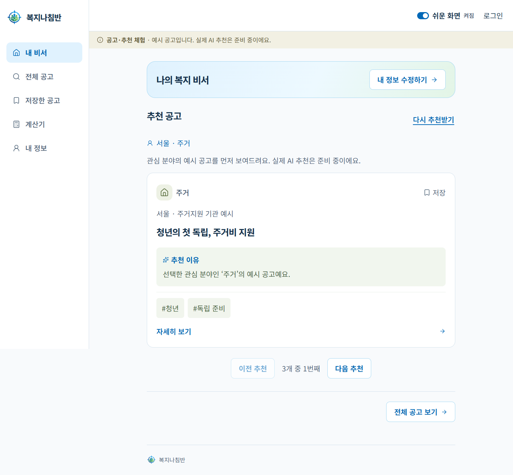

<p align="center">
  
</p>

<h1 align="center">복지나침반</h1>

<p align="center">
  <strong>나에게 필요한 복지를 찾는 길잡이</strong><br />
  내 상황에 맞는 공고를 찾고, 조건을 이해하고, 신청 방법을 확인하는 개인 복지 비서
</p>

<p align="center">
  2026 광운대학교 KW 해커톤 · 팀 복지나침반
</p>

<p align="center">
  <a href="#프로젝트-소개">소개</a> ·
  <a href="#주요-기능">주요 기능</a> ·
  <a href="#사용-흐름">사용 흐름</a> ·
  <a href="#회원가입로그인과-개인정보-보호">회원·보안</a> ·
  <a href="#시작하기">시작하기</a> ·
  <a href="중간발표_자료/readme.md">발표자료</a>
</p>

<p align="center">
  
</p>

> 현재 개발 중인 웹 시제품. 실제 공고를 MySQL에 저장하고 공개 공고 조회·회원 질문 API와 웹 화면을 연결했습니다. 더미 공고는 제거했으며 공개 승인·맞춤 추천·알림은 후속 작업입니다.

## 프로젝트 소개

복지 공고를 찾아도 내 나이와 거주지, 생활 상황에 맞는 지원인지 다시 확인해야 합니다. 복지나침반은 이 과정을 조금 더 쉽게 만들기 위한 프로젝트입니다.

월계1동의 지역 문제에서 출발해, 복잡한 화면이 부담스러운 어르신부터 주소지와 생활지역이 다른 청년, 자격 조건이 낯선 유학생까지 서로 다른 이용 상황을 고려합니다. 사용자가 자신의 정보를 입력하고 관련 공고와 확인할 조건을 살펴보는 안내를 목표로 개발 중입니다.

## 주요 기능

| 기능 | 내용 |
|---|---|
| **내 비서** | 지역·연령대·생활 상황·관심 분야 입력, 관련 공고와 추천 이유를 확인하는 화면 |
| **공고 탐색·저장** | 검색어·태그·분야·지역으로 공고 탐색, 관심 공고를 현재 브라우저에 저장 |
| **쉬운 화면** | 큰 글씨와 단계별 입력, 공고를 한 개씩 보여주는 화면 |
| **소득·재산 계산** | 가구·소득·재산 정보를 바탕으로 서버에서 참고 금액 계산, 추가 확인 항목 안내 |
| **계정·정보 관리** | 일반·카카오 회원가입과 로그인, MySQL에 개인정보 암호화 저장, 동의 후 금융 입력 저장·불러오기·삭제 |

<details>
<summary><strong>쉬운 화면 살펴보기</strong></summary>

한 번에 확인할 정보를 줄이고, 입력과 탐색을 단계별로 진행하는 화면. 일반 화면과 언제든 전환 가능.



</details>

계산 결과는 입력값에 따른 참고치이며, 실제 지원 여부와 신청 조건은 공식 공고에서 확인.

## 사용 흐름

1. **내 상황 입력**: 사는 지역과 연령대, 생활 상황, 관심 분야 선택.
2. **공고와 이유 확인**: 관련 공고를 살펴보고, 필요한 공고는 검색하거나 저장.
3. **공식 안내 확인**: 공고 상세에서 출처와 신청 방법 확인.

## 회원가입·로그인과 개인정보 보호

2026-10-02 기준, 일반 회원가입과 웹 카카오 회원가입을 서버 API에 연결하고 회원 저장소를 MySQL로 전환했습니다.

### 가입과 로그인

- **일반 가입:** 아이디·비밀번호·비밀번호 확인·필수 이메일·이름·만 나이·성별·거주 지역을 입력합니다. 이메일로 받은 6자리 인증번호 확인 후에만 회원가입할 수 있습니다. 가입 완료 후 아이디·비밀번호로 로그인합니다.
- **카카오 가입:** 카카오 인증 후 처음 가입하는 사용자는 이메일을 직접 입력해야 회원으로 저장됩니다. 이메일 인증번호는 요구하지 않으며 이름·만 나이·성별·거주 지역 자동 입력은 사용하지 않습니다. 가입 후 나이·지역을 선택적으로 설정할 수 있습니다. 이미 가입한 카카오 계정은 바로 로그인합니다. 이름이 같다는 이유로 일반 계정과 자동 연결하지 않습니다.
- **전화번호 인증 제거:** 신규 가입에서 전화번호를 수집하지 않으며 이전 전화번호 인증 API도 사용하지 않습니다.
- **가입 화면:** 일반·쉬운 화면 모두 아이디·비밀번호·이메일 인증·기본 정보·가입 확인 순서로 진행합니다. 비밀번호 보기·숨기기, 비밀번호 확인, 입력 오류 안내를 제공합니다.
- **세션:** 웹은 7일 유효한 HttpOnly 쿠키를 사용하고 운영 환경에서는 Secure를 적용합니다. 로그아웃하면 서버 세션을 폐기합니다. 모바일은 웹 쿠키와 분리된 Bearer 인증을 유지하며 카카오 로그인은 현재 웹만 지원합니다.

실제 인증 메일 발송은 서버의 SMTP 설정이 필요합니다. [이메일 인증·메일 발송 설정](backend/docs/email-signup.md)을 참고하세요. 카카오 REST API 키·Client Secret·Redirect URI·웹 주소는 서버 설정으로 관리합니다. 설정이 없으면 카카오 버튼은 준비 중으로 표시합니다. [카카오 설정 및 흐름](backend/docs/kakao-login.md), [인증 API 계약](backend/app/modules/auth/readme.md).

### 회원 저장

회원 로그인은 `DB_ENABLED=false`일 때 기본 SQLite로 사용할 수 있습니다. `DB_ENABLED=true`이면 MySQL을 사용합니다. 회원 암호화/HMAC 키를 생성하거나 설정할 필요가 없습니다.

| 저장 정보 | 보호 방식 |
| --- | --- |
| 아이디·이름·이메일·나이·성별·지역·기존 계정의 전화번호 | 일반 회원 열 |
| 로그인 아이디 검색·중복 확인 | 소문자 아이디의 UNIQUE 열 |
| 비밀번호 | scrypt 단방향 해시 |
| 카카오 가입 대기 닉네임 | nickname 열 |
| 저장에 동의한 소득·재산·가구·차량 입력 | 계정별 JSON |
| 서비스 세션 토큰·카카오 계정 식별자 | 해시 저장 |

회원 정보는 `auth_accounts`, 카카오 연결은 `auth_kakao_identities`, 금융 입력은 `account_financial_profiles`에서 계정별로 관리합니다. 비밀번호 해시, 세션 만료·로그아웃, 카카오 일회성 요청과 브라우저 결합 검증은 유지합니다.

금융 입력은 로그인한 회원이 명시적으로 저장에 동의한 경우에만 계정별로 보관하며, 조회 시 계산 결과를 다시 계산합니다. 회원 정보 수정과 관리자 권한 검사는 기존 HTTP 계약을 유지합니다.

카카오 앱 키·Client Secret과 MySQL을 사용하는 경우의 DB 비밀번호는 Git에서 제외한 서버 `.env`에 보관합니다. 프런트엔드·모바일 번들·공유 문서에는 비밀값을 넣지 않습니다.

이미 암호화된 DB가 있다면 원래 키를 유지한 상태에서 `python -m app.modules.auth init`으로 먼저 복원합니다. 기존 계정·세션·관리자 등급·카카오 연결·금융정보는 유지하고, 복원에 성공한 뒤 현재 서버의 암호화/HMAC 설정을 제거합니다.

[회원 저장·기존 암호화 데이터 복원 안내](backend/docs/member-privacy.md).

## 공고를 정리하는 방식

Gov24·복지로·기관 공고의 원문을 수집하고, 공고에 적힌 조건을 주체·값·단위별로 정리합니다. 명확한 조건은 코드로 처리하고, 복합적인 문장은 AI가 조건 후보를 추출하는 방식입니다.

추출한 조건에는 원문 근거를 남기고, 정보가 없는 경우와 제한이 없는 경우를 구분합니다. 현재 분석 결과는 MySQL에 검토용 초안으로 저장하며, 검토한 공고를 실제 검색·추천 화면에 연결하는 단계로 확장할 계획입니다.

## 기술 구성

| 영역 | 기술 |
|---|---|
| 웹 | React · JavaScript · Vite |
| 서버 | Python · FastAPI |
| 데이터 처리 | 공공 API 수집 · 코드 기반 조건 분류 · AI 조건 추출 |
| 저장 | 공고 MySQL · 회원/금융정보 SQLite 또는 MySQL · 비밀번호 scrypt 해시 |

웹과 서버는 HTTP API로 연결. 현재 인증·금융 계산 API를 제공하며, 전화번호 인증은 제거했고 웹 카카오 로그인을 지원(앱 설정 필요). 정책 MySQL 저장·조회와 DB 기반 LLM 로컬 질의응답을 연결했으며 회원 추천 연동은 다음 단계.

자세한 범위는 [현재 구현 상태](backend/docs/implementation-status.md)에서 확인.

## 시작하기

<details>
<summary><strong>로컬에서 웹 시제품 실행</strong></summary>

Node.js 22.12 이상 필요. 저장소를 내려받은 뒤 아래 명령 실행.

```bash
git clone https://github.com/2026-KW-HACKATHON/15_bokji-compass.git
cd 15_bokji-compass/frontend/web
npm ci
npm run dev
```

터미널에 표시되는 주소에서 웹 화면과 쉬운 화면을 사용할 수 있습니다. 실제 공고 조회·회원가입·로그인·서버 계산에는 별도 백엔드가 필요하며, 회원 기능은 기본 SQLite로 사용할 수 있으며 카카오 로그인은 팀 앱 키 설정이 필요합니다.

[웹 실행 안내](frontend/web/readme.md) · [백엔드 실행 안내](backend/readme.md) · [macOS 안내](backend/docs/macos-development.md)

</details>

<details>
<summary><strong>회원 기능을 위한 MySQL과 암호화 설정</strong></summary>

먼저 [백엔드 설치 안내](backend/readme.md)에 따라 Python 3.13 가상환경과 의존성을 준비합니다. Windows에서 MySQL이 설치되어 있다면 저장소 루트에서 프로젝트 전용 개발 DB를 준비합니다. 이미 DB 설정이 있다면 이를 사용합니다.

```powershell
powershell -NoProfile -ExecutionPolicy Bypass -File backend/scripts/setup-mysql.ps1
cd backend
```

`backend/.env`의 `DB_ENABLED=true`와 DB 접속 설정을 확인하고, 서버를 시작하기 전에 아래 명령을 실행합니다.

```powershell
# 기존 암호화 키가 없을 때만 생성. 실제 키는 화면에 출력하지 않습니다.
.\.venv\Scripts\python.exe -m app.modules.auth keys

# 회원·금융 테이블 준비 및 기존 평문 데이터 암호화
.\.venv\Scripts\python.exe -m app.modules.auth init
```

키 설정은 `AUTH_ENCRYPTION_KEYS`(키 ID와 32바이트 암호키의 JSON), `AUTH_ENCRYPTION_KEY_ID`(신규 암호화 키 ID), `AUTH_LOOKUP_KEY`(독립된 로그인 검색용 비밀키)를 사용합니다. 기존 키를 임의로 새로 생성하거나 덮어쓰지 않습니다.

기존 SQLite 회원 정보가 있는 PC는 서버 쓰기를 중지한 상태에서 다음 이관 명령을 실행합니다. 목적지에 복사한 뒤 원본 SQLite의 회원·금융 개인정보도 암호화하며, 기존 회원 ID와 연결 정보를 유지합니다.

```powershell
.\.venv\Scripts\python.exe -m app.modules.auth init --import-sqlite data/auth.sqlite3
```

준비가 끝나면 `backend` 폴더에서 서버를 실행합니다. 이미 실행 중인 서버는 새 DB·키 설정을 읽도록 재시작합니다.

```powershell
.\.venv\Scripts\python.exe server.py --reload
```

MySQL 테이블 초기화와 데이터 이관은 HTTP 요청에서 자동 실행하지 않습니다. macOS/Linux에서는 `.venv/bin/python`을 사용하고 MySQL 연결은 [개발환경 안내](backend/docs/macos-development.md)에 따라 설정합니다.

</details>

## 검증 결과와 남은 범위

2026-10-02 수정 시 확인한 결과입니다. 아래 검사 수는 각각의 실행 결과이며 합산한 고유 테스트 수가 아닙니다.

| 검사 | 결과 |
| --- | --- |
| 전체 백엔드 회귀 검사 | 287개 통과, 선택 검사 10개 건너뜀 |
| 추가 암호화·키 교체·변조·이관 검사 | 10개 통과 |
| 분리된 실제 MySQL 통합 검사 | 1개 통과: 일반·카카오 가입, 재로그인, 금융 암호화 저장 |
| 웹 회원가입·로그인·카카오 화면 | 데스크톱·모바일 10개 통과 |
| 변경 Python 코드 정적 검사 | Ruff 통과 |

기존 회원의 MySQL 이관, 원본 SQLite의 개인정보 암호화, 개발 서버의 MySQL 연결도 확인했습니다. 카카오 테스트에서는 공급자 응답을 대체했으므로 실제 카카오 사용자 동의·로그인 및 운영 배포 검증과 구분합니다.

맞춤 추천·알림·계정 자동 연결·회원 탈퇴·비밀번호 재설정·자동 보관기간 만료는 후속 범위입니다. 공고 저장과 회원 개인정보 저장의 상세 구현 상태는 [현재 구현 상태](backend/docs/implementation-status.md)에서 확인합니다.

## 프로젝트 문서

- [중간발표 자료](중간발표_자료/readme.md): 발표 PPT·대본·프로젝트 보고서.
- [API 문서](api-management.md): 웹과 서버의 연결 방식, 요청·응답 정의.
- [회원 보안 저장](backend/docs/member-privacy.md): MySQL 전환, 개인정보 암호화, 키 생성·교체 및 기존 SQLite 이관.
- [카카오 로그인](backend/docs/kakao-login.md): 카카오 앱 설정과 최초 가입·재로그인 흐름.
- [백엔드 문서](backend/docs/readme.md) · [프론트엔드 문서](frontend/docs/readme.md): 구조·데이터 처리·화면 설계.
- [유사 서비스 반면교사와 개선 To Do](frontend/docs/competitor-lessons-todo.md): 정보 정확성·모집 상태·공식 링크·추천 설명·이용 검증의 우선순위와 완료 기준.
- [개발 및 협업 안내](CONTRIBUTING.md): 개발환경·작업 규칙·기능별 문서 위치.
